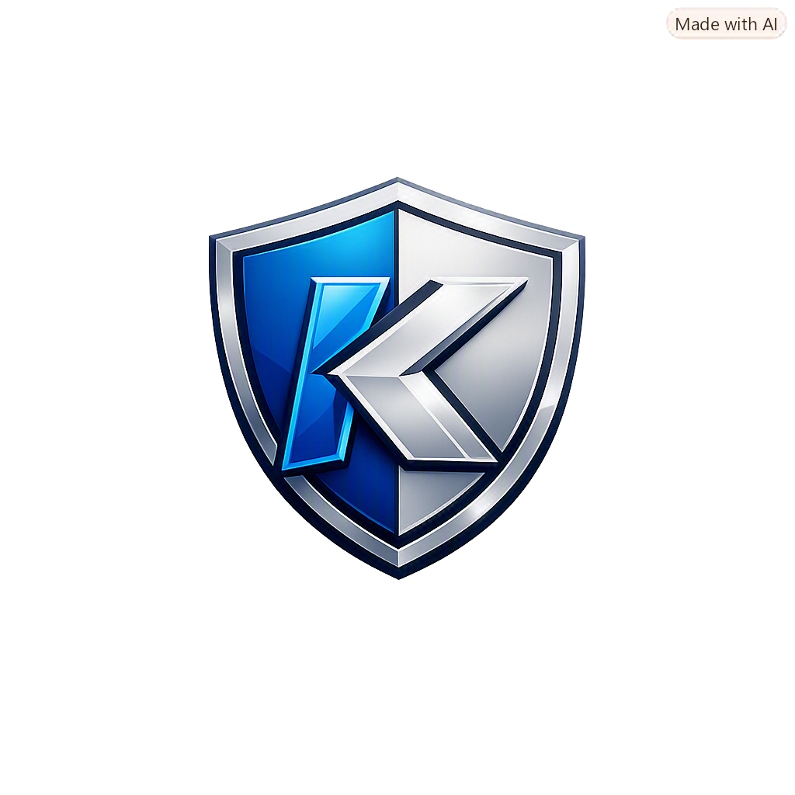

# K-Certificate Manager (K-인증서 매니저) v1.4.5

<div align="center">


**대한민국 공무원 행정전자서명(GPKI/EPKI) 및 금융 공동인증서(NPKI) 자동 탐색·USB 일괄 백업 & PC 역방향 복사 통합 보안 관리 솔루션**

[공식 블로그](https://ahbiyoutvibe.blogspot.com/) • [GitHub 저장소](https://github.com/ahbiyout-all/K-Certificate-Manager) • [회사 홈페이지 (CISNet)](http://www.cisnet.co.kr/)

</div>

---

## 🚀 최신 릴리스 정보 (Latest Release: v1.4.5)

> **버전**: `v1.4.5` (최신 안정화 빌드)  
> **출시일**: 2026-09-30  
> **상세 변경 내역**: [docs/PATCHNOTES.md](./docs/PATCHNOTES.md)

### 🌟 v1.4.5 핵심 업데이트 내용
- **복사 목적지 디스크 지정 팝업창 신규 도입**: 선택/전체 일괄 복사 시 대상 드라이브(USB 메모리, 외장 SSD, 내장 드라이브)를 직관적으로 선택하는 전용 팝업 모달 제공 및 USB 미연결 시 C: 드라이브 자동 오복사 원천 차단
- **동일 디스크 및 USB 내 자가 복사(Self-Copy) 금지 보안 강화**: 선택한 인증서가 이미 위치한 동일 드라이브(예: `C:` ➔ `C:`, `E:` ➔ `E:`)로의 중복 자가 복사 방지 및 시각적 차단 뱃지/경고 제공
- **파일 충돌 해결 옵션 UI 고도화**: 목적지 디스크에 동일한 인증서 폴더가 존재할 경우 건너뛰기(Skip), 최신 덮어쓰기(Overwrite), 이름 변경/백업 보존(Archive)을 사용자가 직접 선택 가능
- **물리 디스크 전용 자동 필터링**: 시디롬(CD/DVD/ISO), 가상 디스크(VHD/RAMDisk), 클라우드 스토리지(구글 드라이브, 원드라이브, 드롭박스, 레이드라이브)를 완벽 제외하고 실제 NVMe/SATA 디스크 및 외장 USB만 안전하게 감지
- **전 테마 고대비 시안성 및 버튼 클릭 반응 애니메이션**: 다크, 회색, 화이트, 베이지 4대 테마 시스템에서 글자-배경 명암비를 WCAG AAA/AA 수준으로 극대화하고, 버튼 클릭 시 입체적인 색상 변화와 액티브 반응 효과 제공
- **Windows 자동화 빌드 스크립트 및 인스톨러 최적화**: 윈도우 정식 설치 마법사(`kcert-manager-v1.4.5-setup.exe`), 단독 실행 파일(`KCertManager_v1.4.5.exe`), 초경량 에디션(`KCertManager-Lite_v1.4.5.exe`) 자동 패키징 완비

---

## 📌 프로젝트 소개 (Overview)

<div align="center">
  
</div>

**K-인증서 매니저 (K-Certificate Manager)**는 복잡하고 번거로운 대한민국 공인/공동인증서(NPKI), 정부 행정전자서명(GPKI), 교육부 전자서명(EPKI)을 한곳에서 안전하게 탐색하고 관리할 수 있도록 설계된 도구입니다.

- **표준 저장 경로 자동 스캔**: `AppData\LocalLow`, `C:\GPKI`, `C:\EPKI` 등 주요 시스템 경로 자동 인식
- **원클릭 USB 백업**: 선택한 인증서를 USB 메모리나 외장 드라이브의 표준 규격 폴더로 안전하게 복사
- **USB ➔ PC 역방향 가져오기**: USB에 저장된 인증서를 내 컴퓨터의 표준 보관함으로 원클릭 등록
- **SHA-256 무결성 검증**: 개인키(`signPri.key`)와 인증서(`signCert.der`)의 위변조 방지 및 트랜잭션 검증
- **듀얼 플랫폼 지원**: 최신 웹 브라우저 에디션(React + Vite) 및 Windows C# WPF 네이티브 데스크톱 에디션 제공

---

## ✨ 핵심 기능 (Key Features)

### 1. 전 규격 인증서 자동 탐색 및 식별
- **은행/신용카드/보험용 (NPKI)**: 금융결제원(yessign), 한국정보인증(KICA), 코스콤(SignKorea) 등
- **공무원 행정전자서명 (GPKI)**: 정부24, 온-나라 시스템, 행정안전부 행정기관용 인증서
- **교육부 전자서명 (EPKI)**: NEIS(나이스), K-에듀파인 교직원 전자서명

### 2. 양방향 안전 복사 및 스마트 감지
- **PC ➔ USB 일괄 백업**: 대상 드라이브의 포맷 형식(FAT32/exFAT/NTFS) 및 용량 분석 후 안전 복사
- **USB ➔ PC 역방향 복사**: 외부 USB 메모리 연결 시 자동 감지 모달 팝업 및 로컬 컴퓨터 등록 지원
- **충돌 방지 및 덮어쓰기 제어**: 동일 인증서 존재 시 버전/유효기간 비교 후 선택적 갱신

### 3. 직관적인 사용자 경험 & 보안
- **8종 테마 지원**: 다크, 화이트, 그레이, 베이지, 파스텔 화이트/그레이/블랙/베이지
- **안전 보관 휴지통**: 실수로 삭제된 인증서의 임시 보관 및 원클릭 복구 기능
- **작업 감사 로그 (Audit Logs)**: 백업, 복사, 복원 등 모든 파일 I/O 작업 기록 저장 및 내보내기

---

## 📂 프로젝트 구조 (Repository Structure)

```
K-Certificate-Manager/
├── src/                          # [웹 에디션] React 19 + TypeScript + Tailwind CSS
│   ├── components/               # UI 모달, 인증서 목록, 드라이브 패널, 헤더/사이드바
│   ├── data/                     # 기본 인증서 데이터 및 브랜딩 에셋
│   ├── utils/                    # USB I/O 서비스, 인증서 파서, 에러 핸들러
│   ├── types.ts                  # 핵심 인터페이스 및 데이터 모델
│   └── App.tsx                   # 메인 애플리케이션 컴포넌트
├── src-wpf/                      # [데스크톱 에디션] Windows C# WPF
│   ├── KCert.Core/               # 순수 .NET 암호화 및 인증서 탐색 코어 DLL
│   └── KCertManager.Wpf/         # WPF 네이티브 데스크톱 UI 앱
├── docs/                         # 상세 기술 및 아키텍처 문서
│   ├── ARCHITECTURE.md           # 파일 시스템 규격 및 보안 설계 원칙
│   ├── KCERT_CORE_DLL_SPEC.md    # KCert.Core.dll 기술 명세서
│   └── BUILD_GUIDE.md            # Windows 자동화 빌드 가이드
├── build.bat                     # Windows 원클릭 자동 빌드 스크립트
├── build.ps1                     # PowerShell 기반 통합 빌드 도구
├── push_to_github.bat            # GitHub 원클릭 자동 커밋 및 푸시 스크립트
├── installer.iss                 # Inno Setup 윈도우 인스톨러 스크립트
└── package.json                  # Node.js 패키지 설정
```

---

## 🚀 빠른 시작 (Getting Started)

### 웹 에디션 실행 (Local Web App)

```bash
# 1. 의존성 패키지 설치
npm install

# 2. 로컬 개발 서버 실행
npm run dev
# 브라우저에서 http://localhost:3000 접속
```

### Windows 네이티브 데스크톱 빌드 (WPF / .NET)

프로젝트 루트의 `build.bat`을 더블 클릭하여 실행하거나 터미널에서 다음 명령어를 입력합니다:

```cmd
# 자동 빌드 및 패키징 실행
build.bat
```

빌드가 완료되면 `release/` 폴더에 배포용 포터블 실행 파일 및 Inno Setup 설치 프로그램(`setup.exe`)이 생성됩니다.

---

## 📤 GitHub에 올리는 방법 (How to Push to GitHub)

본 프로젝트에는 GitHub 원클릭 업로드 스크립트(`push_to_github.bat`)가 포함되어 있습니다.

### 방법 1. 원클릭 배치 파일 사용 (가장 간단)
1. GitHub([https://github.com/new](https://github.com/new))에서 **`K-Certificate-Manager`** 이름으로 새 빈 저장소를 생성합니다.
2. 프로젝트 루트의 **`push_to_github.bat`** 파일을 더블 클릭하여 실행합니다.
3. 브라우저 GitHub 인증 창이 열리면 로그인 및 승인을 완료합니다.

### 방법 2. Git CLI 수동 업로드

```bash
# 1. Git 저장소 초기화
git init
git config user.name "ahbiyout-all"
git config user.email "ahbiyout@gmail.com"

# 2. 파일 스테이징 및 커밋
git add .
git commit -m "feat: release K-Certificate Manager v1.4.5"

# 3. 원격 저장소 연결 및 푸시
git branch -M main
git remote add origin https://github.com/ahbiyout-all/K-Certificate-Manager.git
git push -u origin main --force
```

---

## 📜 라이선스 및 저작권 (License)

- **License**: MIT License (한국어/영어 듀얼 라이선스 정의)
- **Copyright (c) 2026 AhBiYout**. All rights reserved.
- 자세한 라이선스 조항은 [LICENSE.txt](./LICENSE.txt) 또는 [docs/LICENSE.md](./docs/LICENSE.md)를 참조하십시오.

---

## 📞 문의 및 개발자 정보 (Contact)

- **개발자 (Developer)**: AhBiYout
- **공식 블로그**: [https://ahbiyoutvibe.blogspot.com/](https://ahbiyoutvibe.blogspot.com/)
- **GitHub 저장소**: [https://github.com/ahbiyout-all/K-Certificate-Manager](https://github.com/ahbiyout-all/K-Certificate-Manager)
- **소속 회사**: [http://www.cisnet.co.kr/](http://www.cisnet.co.kr/) (CISNet)


